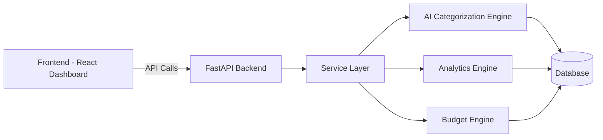
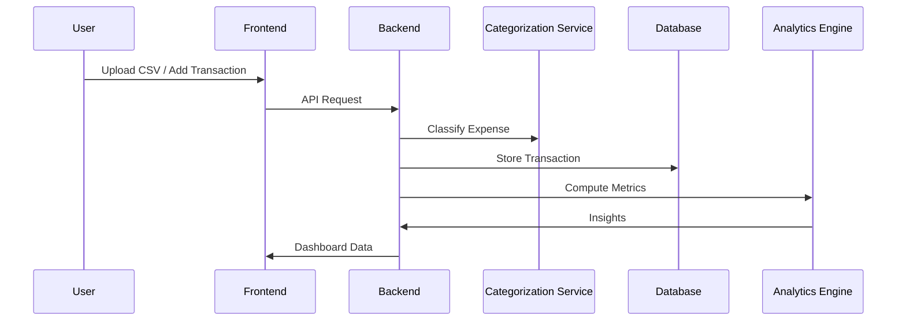

# 🧠 AI Financial Behavior Intelligence Platform

An AI-powered financial analytics system that transforms raw transaction data into behavioral insights, financial health metrics, and risk intelligence.

> Built with a full-stack architecture combining **React**, **FastAPI**, **SQL**, and **AI-driven analytics logic**.

---

## 🚀 Problem Statement

Most expense trackers only store transactions.  
They **don’t analyze behavior**, **detect risks**, or **provide financial intelligence**.

This platform acts as a **financial behavior engine**, not just an expense tracker.

---

## 💡 Solution

This system ingests financial data from multiple sources and applies intelligent processing to:

- Automatically categorize expenses
- Calculate financial health score
- Detect risk patterns
- Compare budget vs actual spending
- Generate behavioral recommendations

---

## 🏗️ System Architecture

## ⚙️ Tech Stack
### Frontend

- React + TypeScript

- Recharts (Data Visualization)

- Axios (API communication)

- Tailwind CSS

### Backend

- FastAPI

- SQLAlchemy ORM

- Pydantic Schemas

- REST API Architecture

- AI / Data Intelligence

- Rule-based NLP categorization engine

- Financial risk analysis logic

- Behavioral scoring model

- Aggregation analytics pipeline

### Database

- SQL (Mysql / Postgres-ready)

## Key Features

| Feature                   | Description                                        |
| ------------------------- | -------------------------------------------------- |
| 📂 CSV Upload             | Bulk transaction ingestion from files              |
| 🧠 AI Categorization      | Smart expense classification with confidence score |
| ❤️ Financial Health Score | Quantified financial behavior metric               |
| ⚠️ Risk Alerts            | Detect overspending & abnormal patterns            |
| 📊 Category Analytics     | Spending distribution insights                     |
| 💰 Budget vs Actual       | Budget tracking intelligence                       |
| 🤖 Recommendations        | Behavioral improvement suggestions                 |

## 📊 Data Flow

## AI Categorization Logic

- Text cleaning & normalization

- Keyword-based intelligent matching

- Confidence scoring

- Fallback classification

#### Example:
- "Swiggy food order" → FOOD (confidence: 0.74)

## 📈 Dashboard Insights

- Financial Health Score Gauge

- Category-wise Spending Chart

- Budget vs Actual Pie Chart

- Risk Alerts Panel

## How to Run
## Backend
- cd backend
- pip install -r requirements.txt
- uvicorn app.main:app --reload
## Frontend
- cd frontend
- npm install
- npm run dev

## 📦 API Endpoints
| Endpoint                   | Purpose                  |
| -------------------------- | ------------------------ |
| `/transactions/upload-csv` | Bulk transaction upload  |
| `/transactions`            | Add or list transactions |
| `/analytics/summary`       | Full financial insights  |
| `/budgets`                 | Budget management        |

## Engineering Highlights

- ✔ Modular service-layer architecture
- ✔ Clean API contracts
- ✔ Scalable analytics pipeline
- ✔ AI logic separated from routes
- ✔ Frontend-backend integration
- ✔ Production-style project structure

## Future Improvements

- ML-based expense prediction

- Bank SMS auto parsing

- Anomaly detection using ML

- User authentication

- Cloud deployment

## Author

### Anil Kumar Gundu
Full Stack + AI Systems Developer
